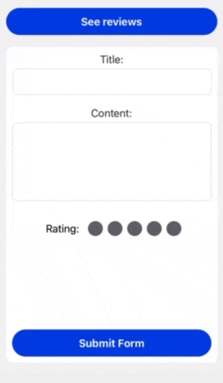

RNReviewApp is a simple application for sharing and exploring reviews.

Right now, you're looking at our MVP (Minimum Viable Product). More to come!

# Getting Started

## Step 1: Install dependencies

```bash
# using npm
npm install

# OR using Yarn
yarn add
```

## Step 2: Launch the Application

Run the following command to start the _Android_ or _iOS_ app:

### For Android

```bash
# using npm
npm run android

# OR using Yarn
yarn android
```

### For iOS

```bash
# using npm
npm run ios

# OR using Yarn
yarn ios
```

Before you know it, you should see the app running in your _Android Emulator_ or _iOS Simulator_. Assuming that your emulator/simulator is set up correctly.

## Congratulations! :tada:

You've successfully run the RNReviewApp. :partying_face:


